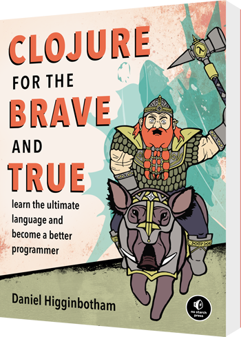

# Clojure Study Group [Work in progress]

## Introduction and goals

The Clojure Study Group is a meetup series organized as part of the larger [Berlin Functional Programming Group](https://www.meetup.com/de-DE/Berlin-Functional-Programming-Group/) effort. Although its goal is to introduce the attendees to the Clojure programming language, it is also a good starting point for learning about [functional programming](https://en.wikipedia.org/wiki/Functional_programming) in general. 

Additionally, the group should provide a discussion ground for the topics covered by the learning material.

We assume no previous knowledge of Clojure or FP, but we still need you to at least be familiar with the fundamentals of programming (you know what a compiler is, variables/constants, functions, conditional statements, loops etc.).

### Why Clojure? 

If you've decided to enter this learning group, you're probably already familiar with the "why" and you can skip directly to the [learning materials](#learning_material). Otherwise please keep reading in order to figure out if the group is the right fit for you. 

There are probably several good reasons why Clojure should be the language of choice for your next project, to name a few:
* __Simplicity:__ Clojure has a very concise Lisp-like syntax that is easy to pick up, but powerful at the same time
* __Interoperability:__ It can run on the JVM, [Node.JS or in the browser](https://clojurescript.org/) together with your existing code and utilize existing libraries
* __Encourages functional programming:__ It was built with immutability, higher-order functions, avoiding side-effects and other FP principles in mind
* __Designed for concurrency:__ With immutability, [Software Transactional Memory](https://en.wikipedia.org/wiki/Software_transactional_memory) and agents, Clojure simplifies development of concurrent applications
* __Maturity:__ It has already been used in production systems for years, has a big and growing community and has been adopted by [many companies](https://clojure.org/community/companies)
* __Other:__ You can find out a lot more about the motivations for Clojure [here](https://clojure.org/about/rationale)

## Learning material

We will use "Clojure for the Brave and True" by Daniel Higginbotham as our primary learning material.

The book is available [online for free](https://www.braveclojure.com/clojure-for-the-brave-and-true/), but we'd really like to encourage you to [buy the printed](https://www.amazon.de/Clojure-Brave-True-Ultimate-Programmer/dp/1593275919/ref=sr_1_1?ie=UTF8&qid=1504465315&sr=8-1&keywords=clojure+for+the+brave+and+true) version and support the author. 

 

## Plan

<!-- THROW-AWAY POINTS -->

* Split learning material into chapters
    * ~ 1 chapter / week?
* Weekly meetings with discussion and executing examples
* Q&A 

<!-- END OF THROW-AWAY POINTS -->

## Requirements for attending

<!-- THROW-AWAY POINTS -->
* A printed (not pirated!!!) copy of the learning material or online access to it. Please keep in mind that we can't always guarantee access to the Internet, so if you go for the online option please make sure you have a means of accessing it
* Laptop with Linux / macOS / Windows
    * Leiningen
    * emacs (optional)
        * A default editor or IDE won't be enforced, although there is a chance it will be harder for us to assist you with a problem if you go the custom way

<!-- END OF THROW-AWAY POINTS -->

## Useful resources

<!-- THROW-AWAY POINTS -->

* Rich Hickey's talks
* Online link to main learning material
* Clojure documentation

<!-- END OF THROW-AWAY POINTS -->